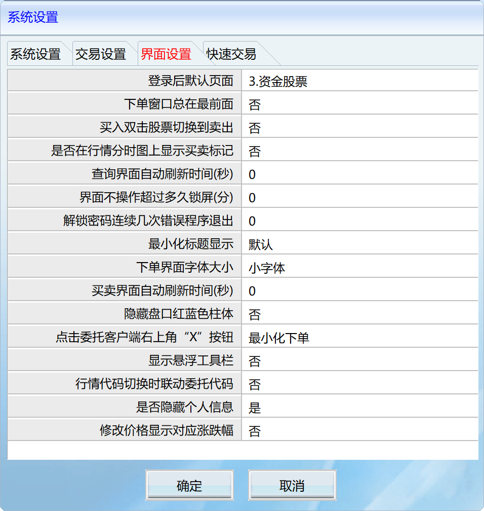
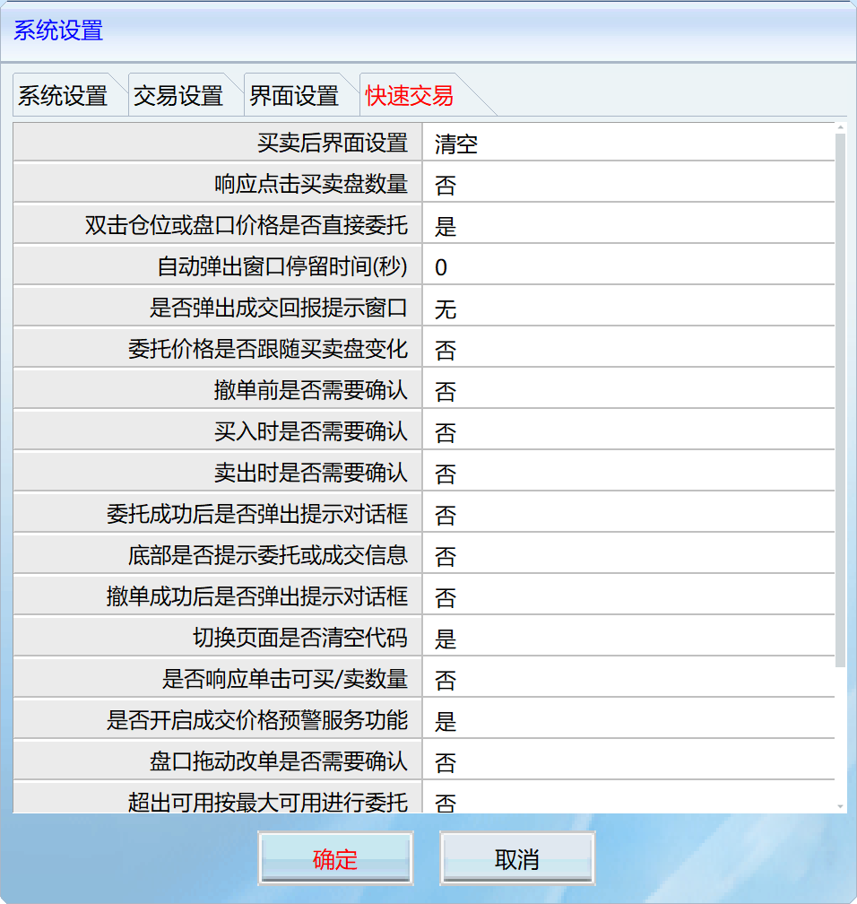
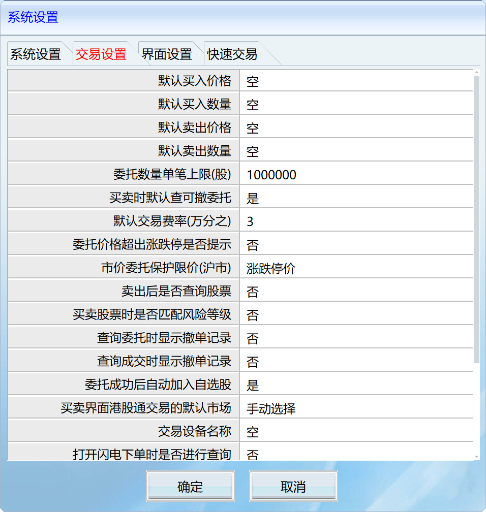
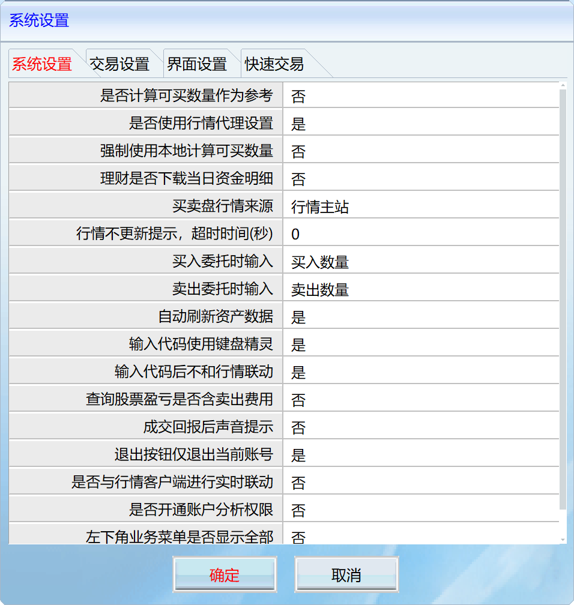

# 同花顺客户端配置

在使用 EasyTHS 之前，需要正确配置同花顺交易客户端。本指南将帮助你完成客户端的安装和配置。

## 下载同花顺客户端

1. 访问 [同花顺官网](https://www.10jqka.com.cn/)
2. 下载并安装**同花顺远航版**或**同花顺标准版**
3. 建议版本：10.4 或更高版本

## 启动交易客户端

EasyTHS 需要同花顺交易客户端保持运行状态。

启动交易客户端的方式：

1. **方式一：通过桌面图标**
   - 双击桌面上的同花顺图标
   - 输入账号密码登录

2. **方式二：通过开始菜单**
   - 点击 `开始` -> `同花顺` -> `网上股票交易系统`

## 打开交易窗口

登录同花顺后，需要打开交易窗口（自动委托程序）。

1. 在同花顺主界面顶部菜单栏，点击 `工具` -> `自动委托程序`
2. 或使用快捷键 `F12`

## 交易窗口配置

打开交易窗口后，需要进行一些基础配置以确保 EasyTHS 能够正常工作。

### 界面设置



在交易窗口中，建议进行以下界面设置：
- 确保窗口标题显示为 "网上股票交易系统5.0"
- 保持窗口可见（不要最小化到托盘）

### 快速交易设置



启用快速交易功能可以提高自动化交易效率：
- 开启快速交易模式
- 设置默认交易数量

### 交易设置



交易相关的重要配置：
- 确认交易账户信息正确
- 检查交易权限设置
- 配置默认交易参数

### 系统设置



系统级配置建议：
- 开启自动重连功能
- 配置超时时间
- 启用交易确认提示

## 配置交易程序路径

### 自定义路径配置

创建配置文件 `config/config.toml`：

```toml
[trading]
# 根据实际安装路径修改
app_path = "D:/同花顺远航版/transaction/xiadan.exe"
```

或通过环境变量配置：

```bash
# Windows PowerShell
$env:TRADING_APP_PATH = "D:/同花顺远航版/transaction/xiadan.exe"

# Windows CMD
set TRADING_APP_PATH=D:/同花顺远航版/transaction/xiadan.exe
```

## 验证配置

运行以下命令验证配置是否正确：

```bash
# 启动 EasyTHS
easyths

# 发送测试请求
curl http://localhost:8000/api/v1/system/status
```

成功连接后会返回：

```json
{
  "status": "ok",
  "connected": true
}
```

## 常见问题

### 找不到交易窗口？

- 确保同花顺主程序已登录
- 检查是否通过 `工具` -> `自动委托程序` 打开了交易窗口
- 确认交易窗口标题为 "网上股票交易系统5.0"

### 连接失败？

- 确认 `xiadan.exe` 路径配置正确
- 确保交易客户端已启动（不是仅主程序）
- 尝试以管理员权限运行 EasyTHS

## 下一步

[系统配置](configuration.md)
