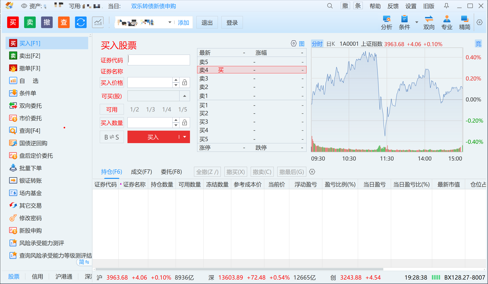

# 同花顺客户端配置

在使用 EasyTHS 之前，需要正确配置同花顺交易客户端。本指南将帮助你完成客户端的安装和配置。

## 下载同花顺客户端

> **下载地址**
>
> - [同花顺官网 - 同花顺远航版下载（推荐）](https://download.10jqka.com.cn/)
> - [同花顺官网 - 同花顺标准版下载](https://download.10jqka.com.cn/)

1. 访问上述下载地址
2. 下载并安装**同花顺远航版**或**同花顺标准版**
3. 建议版本：11.4 或更高版本

## 启动交易客户端

EasyTHS 需要同花顺交易客户端保持运行状态。

启动交易客户端的方式：

1. **方式一：通过桌面图标**
   - 双击桌面上的同花顺图标
   - 输入账号密码登录

2. **方式二：通过开始菜单**
   - 点击 `开始` -> `同花顺` -> `网上股票交易系统`

## 交易客户端主界面

同花顺交易客户端的主界面如下所示：

> **重要提示**
>
> 使用 EasyTHS 前，请务必为交易客户端**开启新版页面**：
>
> - 在交易窗口中，点击工具栏上的"新版"按钮或设置选项
> - 确保界面显示为新版交易界面（通常具有更现代的 UI 风格）
> - 新版页面兼容性更好，能够确保 EasyTHS 正常工作

## 打开交易窗口

登录同花顺后，需要打开交易窗口（自动委托程序）。

1. 在同花顺主界面顶部菜单栏，点击 `工具` -> `自动委托程序`
2. 或使用快捷键 `F12`

## 同花顺下单软件配置

打开同花顺下单软件窗口后，需要进行一些基础配置以确保 EasyTHS 能够正常工作。

**1.注意必须在软件右上角 设置-> 显示悬浮工具栏 确保这个关闭的，之后按照图片所示进行设置，否则不保证功能完整可用**

**2.初次安装同花顺下单软件，进入软件后选择条件单这些功能，要确保不会出现什么条件单风险提示书，如有该窗口，请同意，不然程序无法处理该弹窗，导致条件单功能不可用**

**3.同花顺软件覆盖安装后可能出现设置重置的情况，升级软件时注意，一定要按照图片所示进行软件配置！！！！！！**

### 界面设置

在交易窗口中，建议进行以下界面设置：
- 确保窗口标题显示为 "网上股票交易系统5.0"
- 保持窗口可见（不要最小化到托盘）

### 快速交易设置

启用快速交易功能可以提高自动化交易效率：
- 开启快速交易模式
- 设置默认交易数量

### 交易设置

交易相关的重要配置：
- 确认交易账户信息正确
- 检查交易权限设置
- 配置默认交易参数

### 系统设置

## 常见问题

### 找不到交易窗口？

- 确保同花顺主程序已登录
- 检查是否通过 `工具` -> `自动委托程序` 打开了交易窗口
- 确认交易窗口标题为 "网上股票交易系统5.0"

### 连接失败？

- 确认 `xiadan.exe` 路径配置正确
- 确保交易客户端已启动（不是仅主程序）
- 尝试以管理员权限运行 EasyTHS

## 下一步

[Docker 部署](docker-deployment.md) | [基础用法](basic-usage.md)
